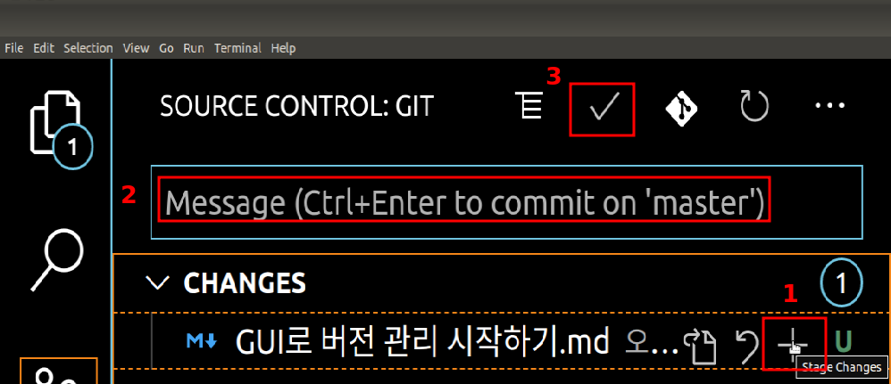
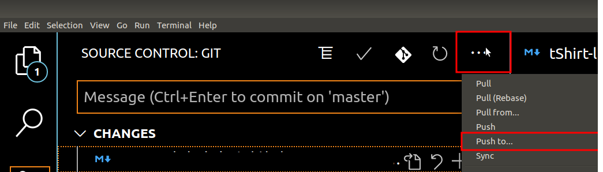
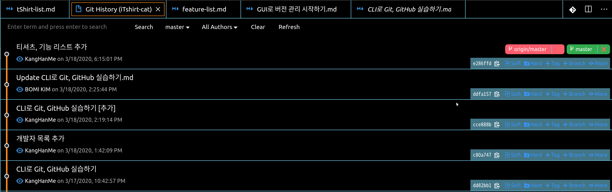

## 오늘의 할일

- [v] 소스트리 설치하기 : 맥 / 윈도우만 지원, 우분투 사용자라서 소스트리 대신 vscode 익스텐션 Git History로 대체
- [v] 비주얼 스튜디오 코드 설치하기
- [v] GitHub 둘러보기
- [v] Git GUI 플러그인으로 커밋 만들고 푸시하기

## 용어정리

- 소스트리 : Git 사용을 도와주는 GUI 프로그램.
- 왜 소스트리를 사용할까?
  : GUI 환경에서 버전 관리를 시각적으로 확인할 수 있다. 그래서 명령어를 일일이 작성할 필요가 없고, 버전 관리를 쉽게 할 수 있다.
- Git History : Git 사용을 도와주는 vscode extension.

## GUI로 버전 관리 실습하기

1. 커밋 만들기

1 - 1 ) 변경 사항 있는 파일/폴더(unstage 상태) 선택한다 : git add 커밋에 추가할 파일 명령어와 같다. 즉, unstage 상태의 파일이 stage 상태로 변경된다.  
1 - 2 ) 커밋 메시지를 작성한다.  
1 - 3 ) 커밋이 만들어진다. 즉, git commit -m "커밋에 대한 설명" 명령어와 같다.

2. 커밋을 원격저장소에 올리기

2 - 1 ) 상단에 더보기 [...] 에서 push to 선택한다. 커밋을 올릴 원격저장소 선택, GitHub의 사용자 이름과 비밀번호 입력을 한다. (이 부분은 소스트리가 훨씬 편하다. 호스팅 계정 인증을 한 번만 해주면 된다. 즉, 커밋할 때마다 사용자 이름, 비밀번호 입력할 필요가 없다.)  
2 - 2 ) Github 원격저장소에서 커밋들을 확인할 수 있다.  
2 - 2 ) Git History의 그래프를 통해 커밋들을 시작적으로 확인할 수 있다.

- [origin/master] : 원격저장소의 버전. 여기서 origin은 원격저장소의 별명이다. 로컬저장소에서 원격저장소를 연결할 때, 앞서 지정했던 별명 origin 이다. 그래서 원격저장소의 별명은 변경도 가능하다. origin이 아니라 다른 별명이 될 수도 있다. 추가적으로 그래프는 로컬저장소의 버전과 원격저장소의 버전이 같으며, 코드 최신화 상태라는 뜻이다.
- [master] : 내 컴퓨터의 로컬저장소의 버전.
