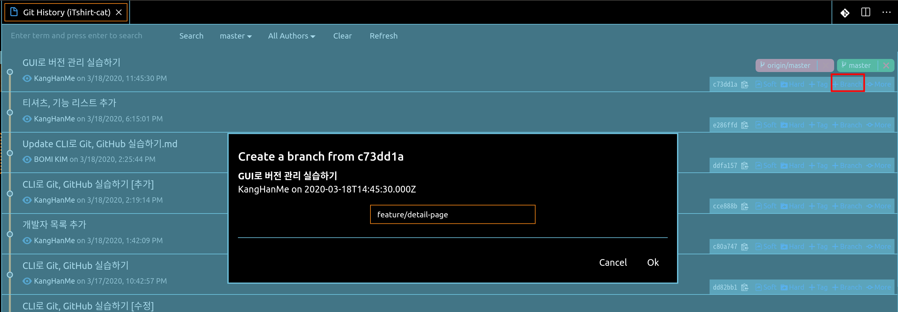
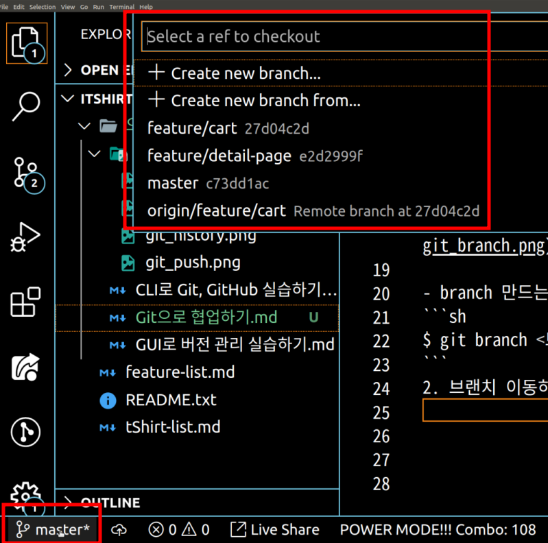
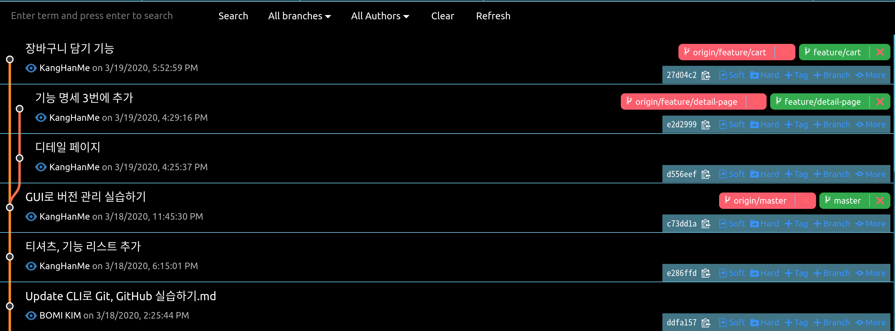
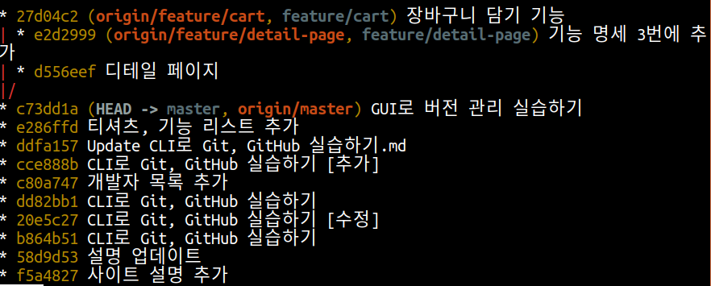

## 오늘의 할일

-[v] Git이 커밋을 관리하는 방식  
-[v] 브랜치 만들기  
-[v] 브랜치 이동하기

## 용어 정리

- 브랜치 : 커밋을 가리키는 포인터이며, 브랜치를 이용해서 하나의 소스코드에서 줄기를 나누어서 작업을 할 수 있다.
- 왜 브랜치(branch)가 필요할까?
  : 여러 사람들이 동시에 버전 관리를 할때에도 서로의 작업물에 의존하지 않고, 원할 때 코드 작업을 올리거나 합칠 수 있다.

## GUI 환경에서 브랜치 만들고, 이동해보기

1. 브랜치 만들기

각 커밋마다 [+branch] 버튼을 이용해서 브랜치 생성한다.  


- 브랜치(branch) 만드는 명령어.

```sh
$ git branch <브랜치 이름>
```

2. 브랜치 이동하기

vscode 에디터 하단에 현재 브랜치 위치가 나타난다. 원하는 브랜치로 선택할 수 있다.  


소스트리에서는 브랜치를 만들 때, 만든 브랜치로 이동하는 설정이 있다. 이 부분에서는 소스트리가 효율성이 높다. 그리고 항상 브랜치로 작업할 때, 작업하고 있는 브랜치 위치를 꼭 확인해야한다. 다른 브랜치에 커밋을 할 가능성이 높아진다.

- 브랜치(branch) 이동하는 명령어.

```sh
$ git checkout <브랜치 이름>
```

# 추가 정보

- 브랜치를 만들고, 만든 브랜치로 이동하는 명령어.

```sh
$ git checkout -b <브랜치 이름>
```

# 브랜치에 대해서 더 자세하게 알아보기

- 아래의 그림에서 최신 커밋에서 `[origin/master] 원격저장소의 버전`과 `[master] 로컬저장소의 버전`을 확인할 수 있다.  
  여기서 [master]가 git이 기본적으로 제공하는 브랜치이고, 최신 커밋을 가리킨다.


- [master] 브랜치가 아닌 [testing] 브랜치가 만들어져 있다. 커밋 f30ab에서 만든 브랜치이므로 같은 커밋을 가리킨다. 로컬저장소에서 [testing] 또는 [master] 브랜치를 이동하는 방법은 무엇일까? [HEAD]라는 특수한 포인터를 이용하여 브랜치 사이를 이동할 수 있습니다. [HEAD] 포인터는 브랜치 또는 커밋을 가리킨다.  
  아래의 그림에서 [HEAD] 포인터는 [master] 브랜치와 c2b9e라는 커밋을 가리킨다.  
  즉, [HEAD] 포인터로 원하는 브랜치 혹은 커밋으로 이동할 수 있다. 예를 들어, 34ac2 커밋으로 [HEAD] 포인터가 이동할 수 있다. 이는 [master]와 [HEAD]가 떨어져 있기 때문에 'Detached HEAD'라고 한다.


# 브랜치 만들고, 이동하는 실습 완성본

[master] 브랜치에서 [feature/detail-page] 브랜치와 [feature/cart] 브랜치로 분기 되었다. 또 강조하지만, 브랜치를 만들 때, 현재 작업 위치, 브랜치가 어디인지 꼭 확인 해야한다.


# CLI 환경에서 모든 브랜치를 그래프로 한 눈에 확인하기

```sh
$ git log --branches --graph --decorate --oneline
```


