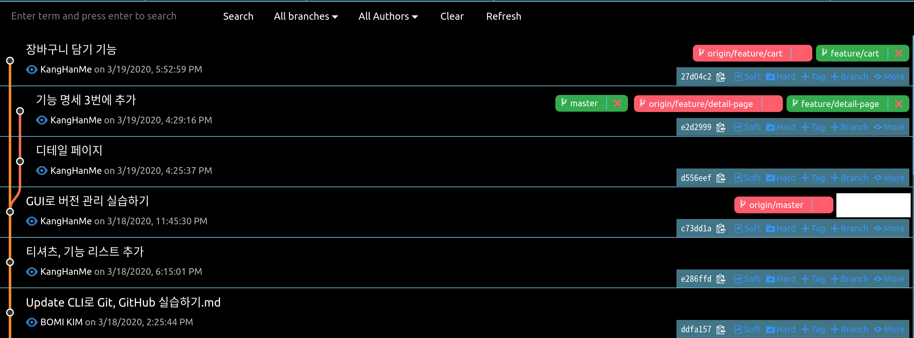
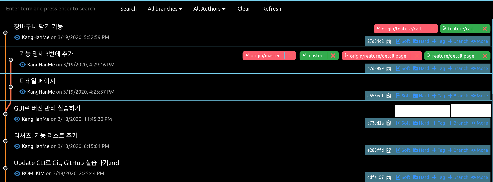

## 오늘의 할일

-[v] 브랜치 병합하기

## 용어 정리

- 병합(merge) : 여러 개의 브랜치를 하나의 브랜치로 합친다.
- 빨리 감기(fast-forward) 병합: [master] 브랜치에 커밋이 없다면, [master] 브랜치를 병합할 브랜치로 가리킨다. [master] 브랜치의 새로운 코드가 반영된 버전이 된다.

## 빨리 감기(fast-forward) 병합 실습하기

- 빨기 감기 병합하기 전, 모든 브랜치 현황  
  

1 ) 기본 브랜치인 [master]에 [feature/detail-page] 브랜치를 병합하기

1 - 1 ) [master] 브랜치로 이동하기

- Git History에서는 vscode 하단에 현재 위치한 브랜치 확인하기
- [master] 브랜치로 이동하는 명령어.

```sh
$ git checkout master
```

1 - 2 ) [feature/detail-page] 브랜치 병합하기

- Git History에서는 [feature/detail-page] 브랜치의 최신 커밋에서 [more] - [Merge this(커밋아이디7자리) commit into current branch] 선택하고, [master] 브랜치에 병합한다.

- [feature/detail-page] 브랜치 변합하는 명령어.

```sh
$ git merge feature/deteail-page
```

1 - 3 ) 병합 완료  

위의 그림은 임의로 [master] 브랜치가 [feature/detail-page] 브랜치를 가리킨다. 왜냐하면 중간에 [master] 브랜치의 변경사항이 있었기 때문에 현재 빨리 감기 병합 전, 모든 브랜치 현황이 다르기 때문이다. fast-forward merge가 무엇인지 설명하기 위해 그림이 수정되었다.  
즉, 'GUI로 버전 관리 실습하기' 커밋에서 '장바구니 담기 기능' 커밋으로 수정한 최신 커밋이기 때문에 두 커밋을 병합하게 되면, '장바구니 담기' 커밋이 된다. 이를 충돌없이 [master] 브랜치가 [feature/detail-page] 브랜치로 이동하는 것을 '빨리 감기(fast-forward)'라고 한다.  
그러면 [master] 브랜치의 최신 코드가 반영된 버전이 된다.

1 - 4 ) 병합한 [master] 브랜치를 원격저장소에 올리기  
위의 그림에서 [master] 브랜치는 [origin/master] 브랜치보다 3 커밋 앞서 있다.  
즉, 원격저장소에 반영되지 않은 커밋 2개가 있다는 것이다.  
아래의 그림은 병합한 브랜치를 원격저장소에 올렸을 때이다.  
  
임의로 [origin/master] 브랜치를 수정했다. 실제로 Git History에서 브랜치의 순서가 다를 수 있다.
