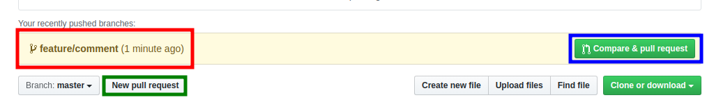
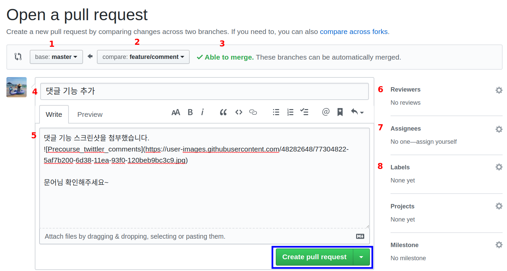
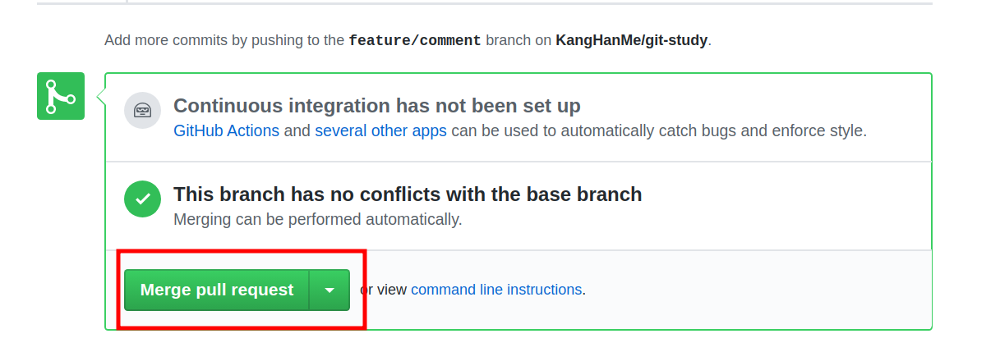
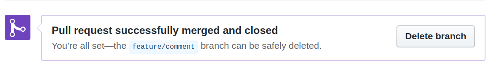
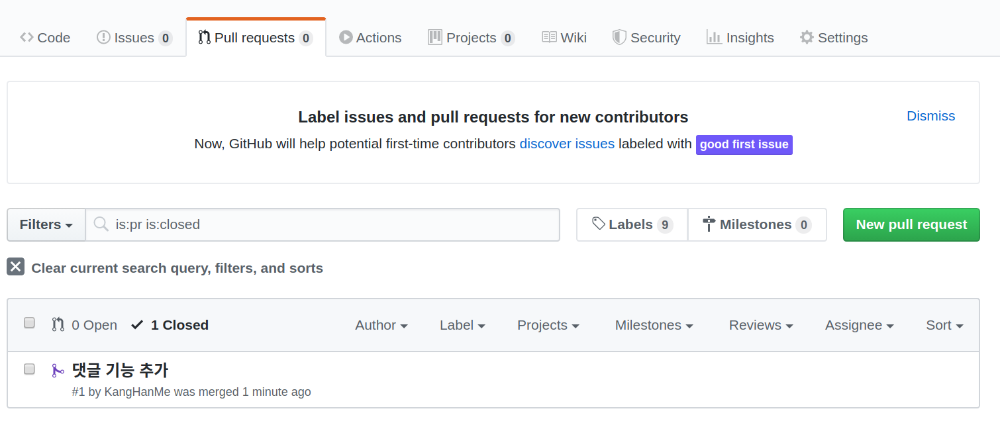
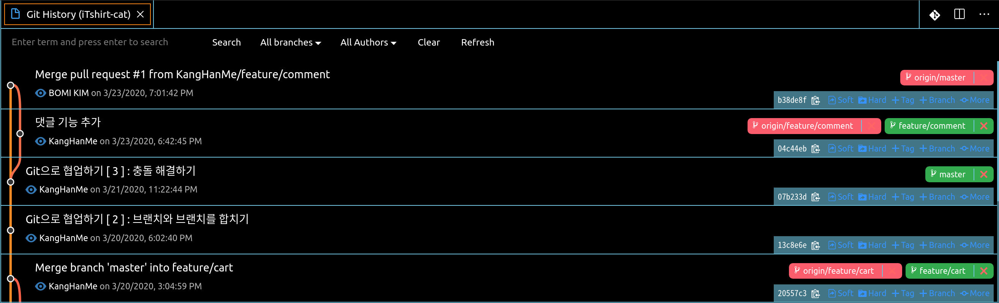
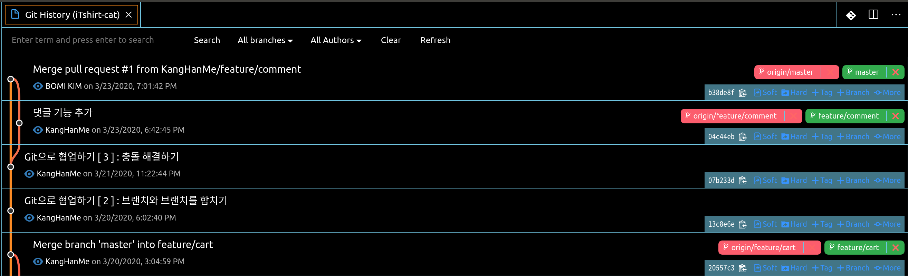

## 오늘의 할일

-[v] 풀 리퀘스트로 브랜치를 예의 바르게 합치기

## 용어 정리

- 풀 리퀘스트(Pull request) : 동료 또는 협력자(contributor)에게 브랜치 병합을 요청하는 메시지를 보내는 것이다.
- 풀 리퀘스트를 왜 필요할까?  
  : 수월한 협업이 가능해진다. 왜냐하면, 각자의 브랜치에서 기능을 개발이 완료되면, 완성 코드가 담긴 [master] 브랜치에 병합하기 전에 풀 리퀘스트를 통해 동료 개발자 또는 협력자와 코드 리뷰 진행하고 서로의 승인에 따라 병합하게 된다. 팀 프로젝트에서 풀 리퀘스트의 중요성을 알 수 있었다. 팀원간의 진행 상황을 파악할 수 있었고, 어떤 부분의 코드가 어떤 이유로 변경되었는지 이야기도 나눌 수 있었다.

## 풀 리퀘스트 실습하기

전제 조건 : [master] 브랜치에 직접 커밋 올리지 않기

1 ) 댓글 기능 만들기 위해 새로운 [feature/comment] 브랜치 생성하기  
1 - 1 ) 항상 현재 내가 위치한 브랜치를 확인해보기 : [master] 브랜치  
1 - 2 ) [master] 브랜치에서 [feature/comment] 브랜치 만들기  
1 - 3 ) 새로운 `comment.md` 만들고, 텍스트를 입력하기

2 ) 커밋 생성하고 원격 저장소에 [feature/comment] 브랜치 올리기  
2 - 1 ) 커밋 생성하기 : 커밋에 추가할 파일 선택하고, 커밋 메시지 작성하기

3 ) 원격저장소에서 브랜치 확인하기  

위의 그림처럼 원격저장소로 푸시한 [feature/comment] 브랜치를 확인할 수 있다.(빨간색)  
그리고 [Compare & pull request](파란색) 버튼은 풀 리퀘스트를 보낼 수 있다.
다른 브랜치로 풀 리퀘스트를 보내고 싶거나 직접 설정을 변경하고 싶다면, [New pull request] 버튼을 클릭한다.(초록색)

4 ) 풀 리퀘스트 날리기  
[Compare & pull request] 버튼 클릭하면 풀 리퀘스트 페이지로 넘어간다.

1.[base: master] : 베이스 브랜치로 병합 결과물이 올라간다.  
2.[compare: feature/comment] : 비교 브랜치로 베이스 브랜치의 비교대상이 되는 브랜치이다.

3. Able to marge : base 브랜치와 compare 브랜치 사이에 충돌이 없고, 병합이 될 수 있다는 뜻이다. 충돌이 발생할 경우 빨간색으로 conflict가 있다고 알려준다.
4. 풀 리퀘스트 제목
5. 풀 리퀘스트 내용 : 동료 개발자가 코드를 이해하기 위해 설명 또는 스크린샷 첨부를 할 수 있다.
6. Reviewers : 협력자를 선택할 수 있다. 협력자가 여려 명일 경우, 풀 리퀘스트를 검통할 협력자를 선택할 수 있다.
7. Assignees : 풀 리퀘스트를 담당하는 동료를 적어준다. 보통 자기 자신이다.
8. Labels : 풀 리퀘스트에 관한 라벨을 달아준다. 예) [백엔드], [프론트]

- 풀 리퀘스트 페이지 입력 창 설명 [출처 : 도서 팀 개발을 위한 Git, GitHub 시작하기]

4 - 1 ) 풀 리퀘스트 만들기

- [Create pull request] 버튼 클릭

5 ) 풀 리퀘스트 확인하기
  

[Merge pull request] 버튼을 클릭하면, 병합 커밋을 만들 수 있다. 그리고 [Confirm merge] 버튼을 클릭한다. 풀 리퀘스트가 성공적으로 병합된다.  

5 - 1 ) 소스트리 또는 Git History에서 [origin/master] 원격저장소가 현재 [feature/comment] 브랜치의 병합 커밋을 가리키지 않고 있음을 확인할 수 있다.  
즉, Git에 새로운 이력을 업데이트 하기 위해서 fetch 명령어를 사용한다. 이는 pull 명령어는 로컬저장소에서 pull 명령어를 통해 원격저장소의 코드를 내려받는데, fetch는 그래프만 업데이트를 한다. 소스트리에서는 [패치] 버튼을 이용해서 쉽게 업데이트 가능하다. Git History에서는 fetch 명령어 기능을 찾지 못해서 [feature/comment] 브랜치 기준으로 CLI 환경에서 `git fetch` 명령어를 사용했다.

- [origin/master]가 `Merge pull request #1 from KangHanMe/feature/comment` 커밋을 가리킨다. 즉, 원격저장소를 통해서 성공적으로 병합 커밋이 된 것을 확인 할 수 있다.

5 - 2 ) 로컬저장소에도 원격저장소의 코드를 최신화하기  
5 - 2 - 1 ) [master] 브랜치로 이동하기  
5 - 2 - 2 ) `git pull origin master`  

- [master]와 [origin/master]가 `Merge pull request #1 from KangHanMe/feature/comment` 커밋을 가리킨다.
