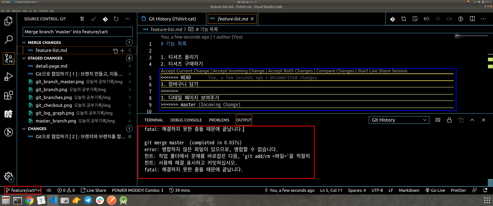
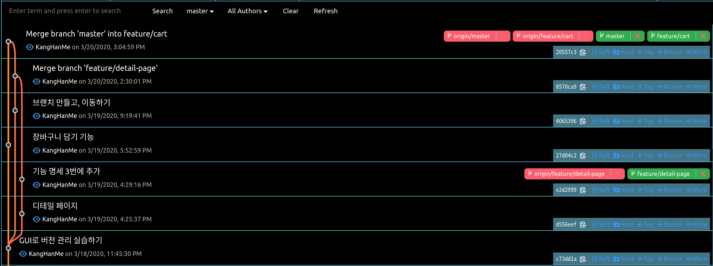

## 오늘의 할일

- [v] : 충돌(conflict) 해결하기   

## 충돌(conflict) 해결 실습하기   
최종적으로 메인 브랜치인 [master]에 [feature/detail-page] 브랜치와 [feature/cart] 브랜치가 병합되고자 한다.   
앞서 Git으로 협업하기 [ 2 ]에서 fast-forward merge로 어떠한 충돌없이 [master] 브랜치와 [feature/detail-page] 브랜치가 병합되었다.   
이번에는 [feature/cart] 브랜치에서 먼저 [master] 브랜치를 병합해보자.    
[master] 브랜치에 바로 병합이 가능하지만, 먼저 내가 작업한 [feature/cart] 브랜치 병합을 작업하고, 버그 혹은 충돌은 없는지 파악하는 것이 다른 사람들과 작업함에 있어서 불편해지는 상황을 줄일 수 있다.   

1. 항상 내가 위치한 브랜치를 확인하기   
1 - 1 ) [feature/cart] 브랜치로 이동하기   
- vscode 하단의 현재 위치한 브랜치를 확인한다.   
- 브랜치 이동하는 명령어   
```sh
$ git checkout <브랜치 이름>
```
2. [feature/cart] 브랜치 병합하기   
2 - 1 ) 병합할 [feature/cart] 브랜치의 최신 커밋에서 [+ more] - [merge this commit(커밋아이디7자리) into this current branch] 통해 병합한다.   

3. 충돌(conflict) 해결하기   
- 소스트리에서 '충돌 병합'팝업 창이 나온다.
- Git History에서는 아래와 같이 나타난다. 즉, [feature/cart] 브랜치의 feature-list.md와 [master] 브랜치의 feature-list.md(파란색 부분)에서 충돌(conflict)이 발생했다.
   
- vscode에서는 (파란색 부분 상단) 충돌을 해결하기 위해서 feature-list.md에 변경하고 싶은 코드를 선택할 수 있다.   
- Accept Current change 선택 - 3. 장바구니 담기 코드가 남는다.   
- Accept Incomming Change 선택 - 4. 디테일 페이지 보여주기 코드가 남는다.   
- Accept Both Changes 선택 - 3. 장바구니 담기 4. 디테일 페이지 보여주기 코드가 남는다.   
- 필요없는 텍스트를 수동으로 지우고, 수정하고 싶은 코드를 남기고, 저장한다.   

4. 병합을 위해서 커밋 하기
4 - 1 ) 병합 커밋(merge commit) 새롭게 생성된다.  
4 - 2 ) [origin/feature/cart] 원격저장소에 올린다.   

5. 최종적으로 [master] 브랜치에 병합된 [feature/cart] 브랜치를 병합하기.   
5 - 1 ) [master] 브랜치로 이동한다.   
5 - 2 ) [feature/cart]의 최신 커밋에서 [+ more] - [Merge this(커밋아이디7자리) into this current branch]통해 병합한다.   
5 - 2 ) [origin/master] 원격저장소에 올린다.   
최종적으로 아래의 그림에서 [master] 브랜치의 포인터가 최신 커밋을 가리키고 있다. 중간에 "Merge branch 'feature/detail-page'" 병합 커밋은 git 학습을 하고 기록하기 위해 '브랜치 만들고, 이동하기' 커밋을 만들었기 때문에 생긴 커밋이다. 즉, fast-forward merger에 해당하지 않는다.   
   
## 추가 정보
- 원격저장소에서 보이는 기본 브랜치는 [master]이다.   
- 원격저장소 - [Settings] - [Branches] - Default branch를 설정할 수 있다.  
- [Branch: master] 드롭다운 버튼을 클릭하여 원격저장소에 올려진 브랜치들을 확인할 수 있으며, 기본 브랜치를 설정할 수 있다.   
- 원격저장소에서 커밋 메시지가 "Merge branch 'master' into feature/cart"인 병합 커밋을 확인 할 수 있다.   


