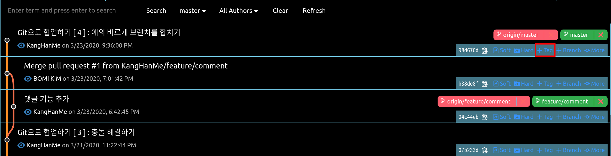
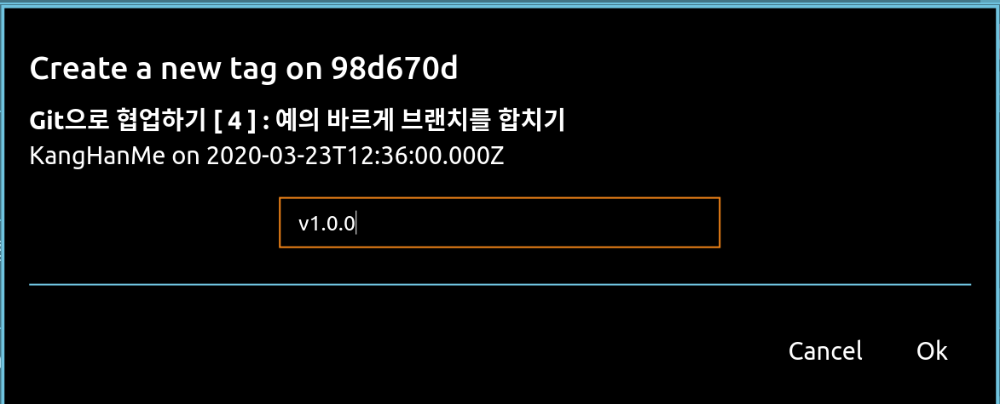
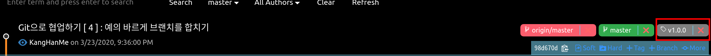
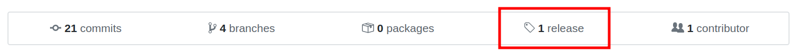
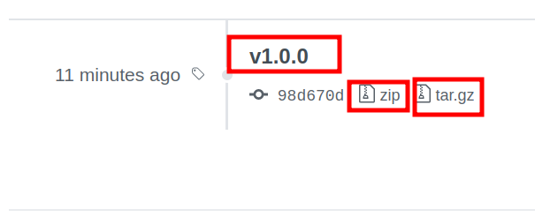

## 오늘의 할일

-[v] 개발이 완료되었고, 출시하기

## 용어 정리

- 릴리즈(release) : 프로그램을 출시하는 것.
- 태그(tag) : 출시 버전을 표시한다. 또한 특정 커밋을 가리킨다.

## 출시(release) 실습하기

- 다양한 기능을 개발하여 [master] 브랜치에 합쳤다. 이제 서비스로 출시한다고 가정해보자.  
  프로그램을 출시하거나 업그레이드를 할 때, 프로그램의 버전명을 명시한다. 메이저(major) 업그레이트와 마이너(minor) 업그레이드로 나뉜다. 메이저 업그레이드는 크게 변경될 내용이 있을 경우, 작은 변화가 있는 경우 마이너 업그레이드를 한다. [ 출처 : 도서 팀 개발을 위한 Git, GitHub 시작하기 ]

1 ) 특정 커밋에 tag 붙이기

- 출시하고 싶은 커밋에 버전 `v1.0.0`라고 기록하고 태그 만들기

1 - 1 ) 현재 위치한 브랜치 확인하기

- [master] 브랜치에서 [+tag] - `v1.0.0` 태그 만들기
  
  

1 - 2 ) Git History에서 `tag` 확인하기  
 

2 ) 원격저장소에 tag 올리기

- 원격저장소에서 tag를 확인할 수 있다.
- 소스트리에서는 [tag] 버튼과 [push] 버튼으로 쉽고 빠르게 수행할 수 있다. Git History에서는 `tag` 생성은 가능하나, 원격저장소에 `tag`를 올리는 방법은 찾지 못했다. 그래서 결국 CLI 환경에서 명령어를 이용했다.

```sh
$ git push tags
```

:`origin` 원격저장소에 `master`라는 브랜치에 대한 모든 태그를 올린다는 뜻이다. `git push origin master`에서 `origin master`가 생략된다.

- 원격저장소에서 태그를 확인할 수 있다.
  
- 해당 버전의 압축 파일을 다운로드 할 수 있다.  
  
