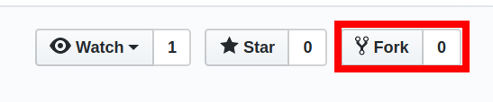
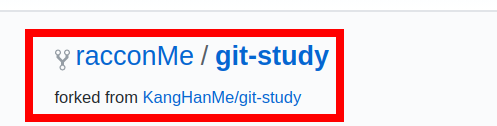
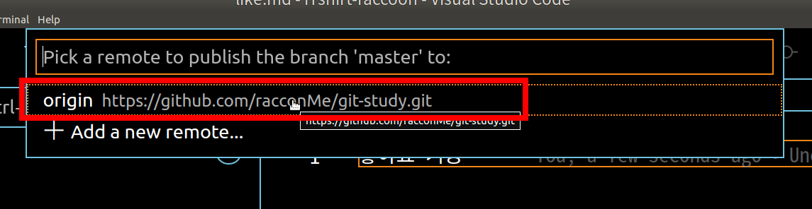
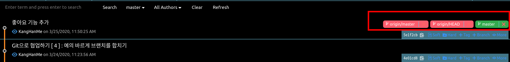

## 오늘의 할일

-[v] 둘 이상의 원격저장소로 협업하기  
-[v] 원본저장소를 복사해서 너구리의 원격저장소를 만들기

## 용어 정리

- 원본저장소 : 원래의 원격저장소. 원격저장소를 복사해서 새로운 원격저장소를 만드는 실습을 해볼 것이다. 그래서 원래의 원격저장소와 복사한 원격저장소를 구분짓기 위함이다.
- fork : 다른 개발자가 만든 원격저장소를 통째로 복사하여 나의 원격저장소를 만드는 것.
- 왜 fork를 할까?
  : fork한 원격저장소는 fork한 사람만 사용할 수 있다. 적은 수의 협력자가 있을 경우에는 브랜치를 나눠서 기능 개발을 하면된다. 하지만 50명이상 또는 그 이상의 협력자가 있을 경우는 각자 fork를 해서 기능 개발을 하고 풀 리퀘스트 요청을 하는 것이 좋다.
- branch vs fork
  |제목|의의|편리한 점|불편한 점|
  |----|-------|-------|-------|
  |브랜치|하나의 원본저장소에서 분기를 나눈다|하나의 원본저장소에서 코드 커밋 이력을 편하게 볼 수 있다.|다수의 사용자가 다수의 브랜치를 만들면 관리하기가 힘들다|
  |포크|여러 원격저장소를 만들어 분기를 나눈다|원본저장소에 영향을 미치지 않으므로 원격저장소에서 마음껏 코드를 수정할 수 있다.|원본저장소의 이력을 보려면 따로 주소를 추가해야한다|  
  [ 출처 : 도서 팀 개발을 위한 Git, GitHub 시작하기]

## 원본저장소 복사해서 새로운 원격저장소 만들기

- 먼저, 이 전에 출시한 서비스를 생각해보자. 개발자 너구리가 새로운 기능을 추가했으면 좋겠다고 생각하여 직접 코드를 작성해서 원본저장소에 커밋을 올리고 싶어한다.
  하지만 기본적으로 원본저장소를 만든 사람만이 커밋을 직접 올릴 수 있다. 그래서 개발자 너구리가 원본저장소에 커밋을 올리고 싶다면, 원본저장소의 소유주가 개발자 너구리를 협력자(collaborator)로 등록을 해야한다.
- 원본저장소 - [Settings] - [Manage access] - [invite a collaborator]
- 하지만 협력자가 많을 수록 원본저장소를 관리하기가 힘들어진다. 또한 개발자가 직접 원본저장소에 커밋을 올리는것이 부담스러울 수도 있다. 그래서 풀 리퀘스트(Pull request)를 통해 개발자는 fork한 원격저장소에서 기능을 개발하고, 원본저장소의 소유자에게 병합 요청(Pull request)을 한다. 그러면 원본 저장소의 소유자가 코드 리뷰 또는 병합 요청을 검토해서 원본저장소에 반영한다.
- fork했을 때, 저장소의 주소를 확인하자.
- 예를 들어, 원본저장소의 주소 : `github.com/KangHanMe/iTshirt` ==fork==> 새로운 원격저장소의 주소: `github.com/RacoonMe/iTshirt`

## 실습하기

1 ) 남의 저장소를 내 계정에 복사하기  
1 - 1 ) 실험을 위해 너구리 계정을 만들기  
1 - 2 ) 원본저장소로 이동하기  
1 - 3 ) 원본저장소를 포크 하기  
  
1 - 4 ) 원격저장소로 자동으로 이동
  
1 - 5 ) 원격저장소를 로컬저장소로 받아오기
: 소스트리에서 [clone] - [원격저장소 주소] 혹은 `git clone https://github.com/racconMe/git-study.git .`. 클론 후, 해당 원격저장소의 커밋 히스토리를 확인 할 수 있다.
1 - 6 ) 소스트리에서는 기존 계정에서 개발자 너구리 계정을 로그인하기
: Git Histroy에서는 개발자 너구리의 원격저장소가 클론된 폴더를 연다. 대신에 원격저장소로 푸시할 때, 아이디와 비밀번호를 입력하면 된다.

1 - 7 ) 커밋 생성 및 원격저장소에 올리기
: `like.md`을 커밋에 추가하여 `racconMe`의 `[origin/master]`에 올리기

아래의 그림에서 [master] 브랜치와 [origin/master] 브랜치를 확인할 수 있다.

